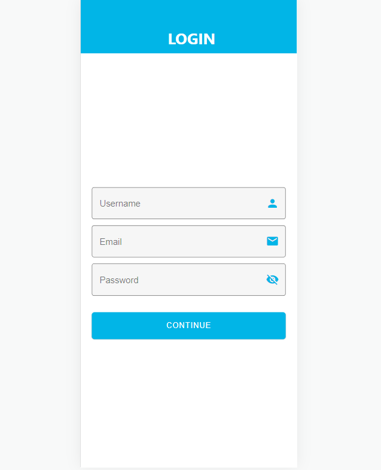
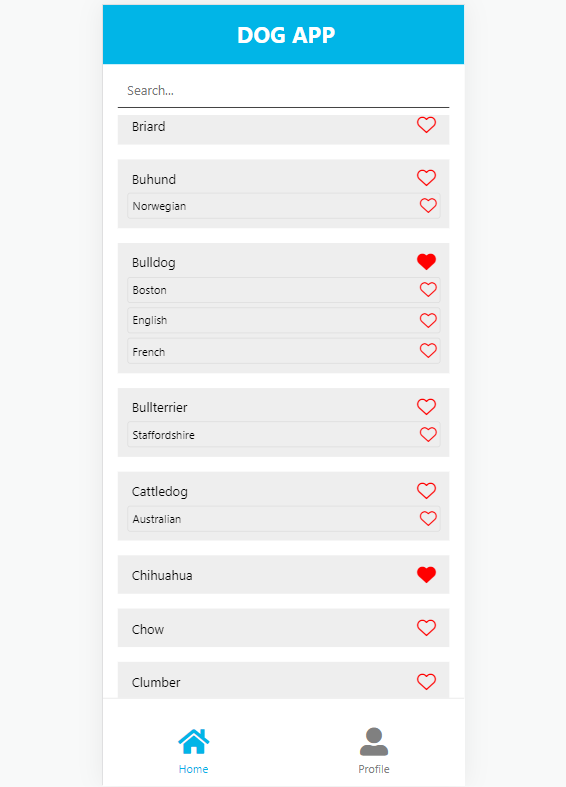
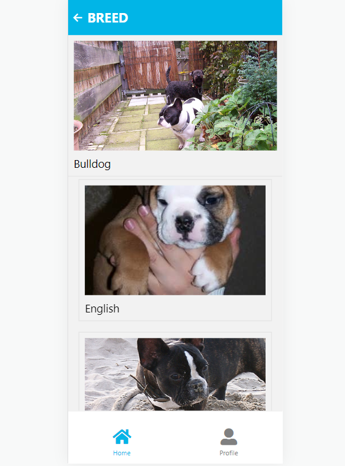
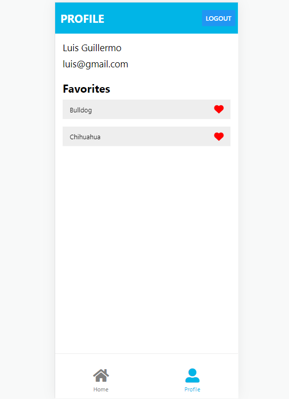

# DOG APP

Welcome to the DOG APP! an Expo React Native aplication that shows a list of breeds and sub breeds of dogs from the Dog API.

You can login and add your favorite breeds to your own favorites list!

## Installation

To run this project you need to clone this repository and use node 16.0+

```bash
nvm install 16
```
```bash
npm run start
```
Once is running, press **w** key to open it in your browser.

```bash
w
```
## Screenshots
**Login**

A simple login screen where users add their Username, email and password for their account.



**Home page**

Main screen of the app where all the breeds and sub breeds from the Dog API are listed.

You can use the searchbar at the top to find an specific one and press the heart icon to add it to your favorite list.



**Specific Breed Selection**

Once you select a breed or sub breed, this screen will show you a random photo fetched from the Dog API for that specific breed.

If you scroll down you will see all the sub breeds. If you go back and press the breed again, new random photos will load.



**Profile and Favorites List**

In the profile page you can see your Username, email and the list of your favorite breeds.

Press the name of the breed to take you to the Specific Breed Selection view.

Press the heart to remove a breed from your favorite list.

You can logout by pressing the button at the top right corner, this will take you to the login screen.



## Contributing
Video:
https://youtu.be/MF7mG60LKrY
## Contributing
Pull requests are welcome. For major changes, please open an issue first to discuss what you would like to change.

## Contact Me
[](https://www.linkedin.com/in/luis-guillermo-moreno-lombardo/)
[](mailto:l.guillermo01gmail.com)